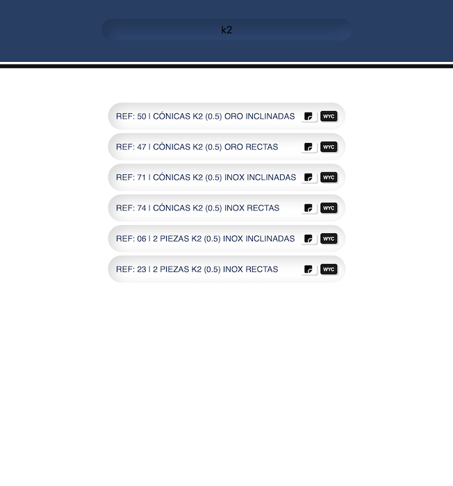

# WYC RefFinder

**WYC RefFinder** es una herramienta sencilla y eficaz para buscar, gestionar y organizar referencias de forma rápida y fácil.


## 👀 Vista previa
<section style="display: grid; grid-template-columns: 1fr 1fr 1fr; gap: 10px;">
<h3> 🔍 Buscar</h3>

<h3> 📦 Box</h3>

<h3>🏷️ Sticker</h3>

</section>

---

## ✨ Características

- ⚡ Búsqueda rápida y eficiente de referencias.
- 📂 Gestión organizada para evitar pérdidas o duplicados.
- 🖥️ Interfaz simple y fácil de usar.
- 📦 Instalación y uso sencillos mediante npm.

---

## 🛠️ Instalación

Clona el repositorio y luego instala las dependencias con npm:

```bash
git clone https://github.com/JuliAlchemDev/wyc-ref-finder.git
cd wyc-ref-finder
npm install
```

---

## ⚙️ Cómo usar

1. 🖥️ Abre la terminal
2. 📂 Cambia al directorio del proyecto con `cd wyc-ref-finder`
3. 📝 Abre Visual Studio Code con `code .`
4. 📄 Abre el archivo `index.html`
5. 🚀 Inicia el servidor local con la extensión Live Server (Go Live, esquina inferior derecha)


